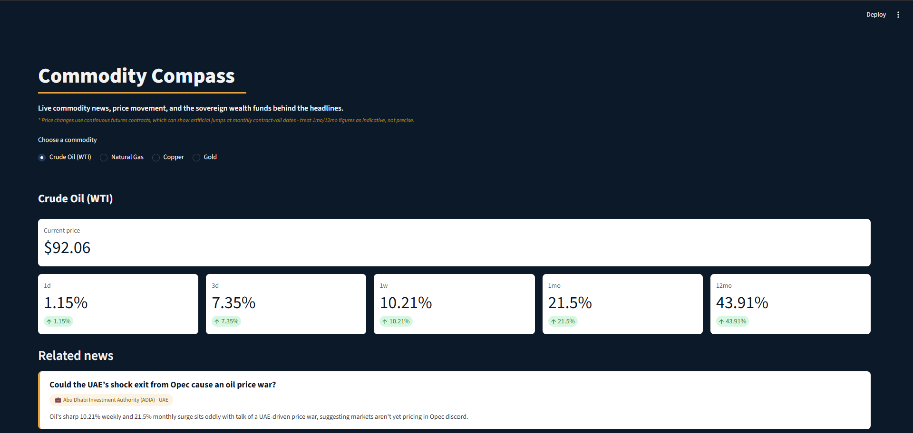

# Commodity Compass

An interactive dashboard pairing live commodity news with real price movement, an annotated price history chart, AI-generated market analysis, and the sovereign wealth fund tied to the country each story relates to — built to explore how commodity markets and geopolitics intersect.

**Live demo:** [commodity-swf-dashboard-hts6qcipexvotqkyumo8pk.streamlit.app](https://commodity-swf-dashboard-hts6qcipexvotqkyumo8pk.streamlit.app/)



## What it does

For a chosen commodity (oil, gas, copper, or gold), the dashboard:
- Pulls recent, relevant news articles (The Guardian API)
- Shows the current price and % change over five time windows (1d, 3d, 1w, 1mo, 12mo), via Yahoo Finance
- Matches each article to the country it's about, and looks up the relevant sovereign wealth fund
- Generates a short, data-grounded commentary on each article using Claude (Anthropic's AI model) — grounded specifically in the real price numbers already calculated, not left to invent figures
- Displays an interactive price chart with hover-based annotations linking headlines to the exact price point they relate to, plus a milestone reference line for commodities with a well-known psychological price level
- Generates a longer market overview per commodity, alongside the per-article commentary, summarizing recent price action and explaining its geopolitical sensitivity rating

## How it works

The project is split into five focused Python modules:

| File | Responsibility |
|---|---|
| `reference.py` | Commodity and country/fund reference data |
| `prices.py` | Live price + historical % change windows (yfinance) |
| `news.py` | Relevance-ranked news fetching (The Guardian API) |
| `matching.py` | Matches an article to a country/fund based on headline text |
| `commentary.py` | Generates grounded AI commentary via the Anthropic API |
| `app.py` | Streamlit dashboard tying everything together |

## Known limitations

Built and documented honestly rather than glossed over:

- **Futures contract roll effects**: price tickers track continuous futures contracts, which can show artificial jumps at monthly contract-roll dates. 1mo/12mo figures should be read as indicative, not precise (flagged directly in the dashboard).
- **Single fund per country**: some countries (e.g. UAE) run multiple sovereign wealth funds; this project matches to one representative fund per country as a deliberate simplification.
- **Single news source**: uses The Guardian specifically, chosen for its production-safe free tier; a fuller version would aggregate across multiple outlets.
- **Headline-based matching**: country matching is based on text mentions in the headline (falling back to the article summary) — a reasonably reliable heuristic, but not full NLP-based entity recognition.

## Future improvements

Deliberately scoped out of this version, noted honestly rather than left unaddressed:

- **Multi-currency support**: prices are currently USD-only; a fuller version would let users switch currency via a live forex API.
- **Full Brent Crude tracking**: oil currently shows Brent as a simple reference price alongside WTI; a fuller version would give Brent its own complete price-window and chart view, toggleable against WTI.
- **Multi-source news aggregation**: currently uses The Guardian only, chosen for its production-safe free tier; a fuller version would aggregate across several outlets.
- **R/Stata quantitative layer**: exporting the underlying price history for a proper time-series analysis (e.g. volatility clustering, return distributions) in R, tying the project to my econometrics coursework directly.

## Quantitative Volatility Layer

To build genuine, evidence-backed R/Stata experience (previously a CV skill with no
project to point to), the dashboard was extended with a volatility analysis layer,
split across two parts:

**Live metric (Python)** — `prices.py` computes 20-day annualised rolling volatility
from daily log returns for the selected commodity, displayed alongside the existing
price-change windows. This uses the same continuous futures data as the rest of the
dashboard, so it inherits the same roll-date limitation described above.

**Offline analysis (R)** — a separate script (`r_analysis/analysis.R`) exports price
history for all five commodities and computes daily log returns, 20-day rolling
volatility, and descriptive statistics (mean return, annualised volatility, skewness,
kurtosis) for each. Aluminium was used as a worked case study, including a check for
volatility clustering via the autocorrelation function (ACF) of squared returns.

*Why offline rather than live: Streamlit Community Cloud doesn't support an R runtime,
so the R analysis can't run as part of the live app. The core volatility metric was
reimplemented in Python for live display; the two independently-built versions were
cross-checked against each other and returned consistent values (e.g. aluminium:
27.8% live vs 26.8% offline), which gave some confidence the Python version is correct.*

### Summary statistics (13-month sample, all commodities)

| Commodity | Annualised Vol | Skewness | Kurtosis |
|---|---|---|---|
| Aluminium | 26.8% | -0.83 | 6.67 |
| Crude Oil (WTI) | 52.9% | -0.78 | 7.88 |
| Gold | 28.4% | -1.40 | 10.95 |
| Copper | 27.0% | -0.05 | 3.77 |
| Natural Gas | 97.5% | -3.95 | 49.45 |

Industrial metals and gold clustered in a similar volatility range (27-28%), while
energy commodities were substantially more volatile — natural gas in particular
showed extreme fat-tailed behaviour (kurtosis ≈ 49), consistent with its known
susceptibility to sudden supply-shock price spikes. Negative skew across most
commodities suggests downside moves tend to be sharper than upside ones over this
sample.

### Volatility clustering: an honest finding

Aluminium's rolling volatility chart shows visually distinct high- and low-volatility
regimes, consistent with clustering. However, the ACF of squared returns did **not**
show the textbook pattern of consecutive significant autocorrelation at short lags
that would confirm strong clustering statistically — most early lags (1-8) fell
within the significance bounds, with isolated significant spikes at longer, scattered
lags (~9, ~14, ~22 days) instead.

This is reported honestly rather than rounded up to "clustering confirmed": the
regime shifts visible in the chart may be driven by a small number of discrete
events rather than a persistent, self-reinforcing volatility process. A reasonable
next step would be testing this more rigorously with a GARCH model rather than
relying on the ACF alone.

### Known limitation / next step

The current chart displays price as a single line with news markers and a milestone
threshold overlaid separately. Planned next iteration: rebuild as an integrated
candlestick chart with a volume subplot and short/long moving averages, based on
direct feedback that the current layout under-uses what the underlying OHLCV data
can show.

## Tech stack

Python · Streamlit · yfinance · Guardian Open Platform API · Anthropic API (Claude)

## Running it locally

```bash
git clone https://github.com/SalimR61/commodity-swf-dashboard.git
cd commodity-swf-dashboard
python -m venv venv
.\venv\Scripts\Activate
pip install -r requirements.txt
```

Create a `.env` file with:

GUARDIAN_API_KEY=your_key_here
ANTHROPIC_API_KEY=your_key_here

Then run:
```bash
streamlit run app.py
```

## About

Built by Salim, a third-year Economics student with a strong interest in commodities and geopolitics, as a hands-on project integrating live market data, news APIs, and AI into a working tool.

[LinkedIn](https://www.linkedin.com/in/salim-rachid-3247a8278/)